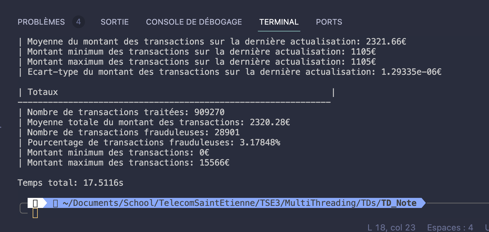

# Manage and analyse transactions from banks 
## Each transaction is recorded and stored inside a .csv file
- id account who gives
- id account who receive
- amount
- signature

### Details
- Signature is a numeric result that checks if the transaction is a fraud or not 
- After each transaction -> update of statistics metrics

## Content:
main.cpp : main program with the treatment in multithreading
main_seq.cpp : same program but in sequential

# Results 
# TD Noté

### Vérificaiton résultat + Découverte données

Utilisation de python et pandas pour voir le nombre de lignes + Valeur min max et info statistique intéressantes:

|       | Source Account | Destination Account | Amount     | Signature     |
| ----- | -------------- | ------------------- | ---------- | ------------- |
| count | 1000000.000000 | 1000000.000000      | 1000000.00 | 1.000000e+06  |
| mean  | 499.218960     | 499.579172          | 2391.95603 | -2.117608e+06 |
| std   | 288.752217     | 288.754757          | 1807.69148 | 6.062849e+05  |
| min   | 0.000000       | 0.000000            | 0.00       | -3.110000e+06 |
| 25%   | 249.000000     | 250.000000          | 954.10500  | -2.581030e+06 |
| 50%   | 499.000000     | 500.000000          | 2021.74000 | -2.217382e+06 |
| 75%   | 749.000000     | 750.000000          | 3449.70500 | -1.757232e+06 |
| max   | 999.000000     | 999.000000          | 15566.1800 | 1.980400e+06  |

### Parcours

- Je n'avais pas eu le temps de finir mon plan de dév, j'ai donc commencé à développer mon programme en séquentiel.

1. Lecture csv
2. Traitement
3. Affichage
4. Transfo code seq en parra
5. Benchmark

### Benchmark :

</img>
Voici les résultats obtenu je pense qu'il y a un petit soucis de sync quelque part
mais le code en séquentiel prenanit plusieurs minutes mais n'arrivait pas à terminus

### Ce que je n'ai pas pu faire

- std : Elle est présente mais foireuse
- Médiane : pas faite du tout
- Quartile : pas faite du tout

### Fichier présents :

main.cpp -> Programme qui tourne en parralèle
main_seq.cpp -> Programme qui tourne en séquentiel
